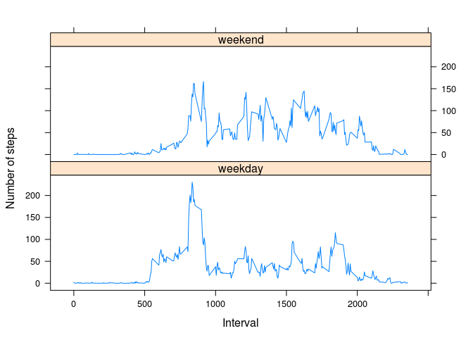

# Reproducible Research: Peer Assessment 1


## Loading and preprocessing the data

```r
data <- read.csv("activity.csv", colClasses = c("numeric", "character", "numeric"))
summary(data)
```

```
##      steps            date              interval     
##  Min.   :  0.00   Length:17568       Min.   :   0.0  
##  1st Qu.:  0.00   Class :character   1st Qu.: 588.8  
##  Median :  0.00   Mode  :character   Median :1177.5  
##  Mean   : 37.38                      Mean   :1177.5  
##  3rd Qu.: 12.00                      3rd Qu.:1766.2  
##  Max.   :806.00                      Max.   :2355.0  
##  NA's   :2304
```

```r
data$date <- as.Date(data$date, "%Y-%m-%d")
head(data)
```

```
##   steps       date interval
## 1    NA 2012-10-01        0
## 2    NA 2012-10-01        5
## 3    NA 2012-10-01       10
## 4    NA 2012-10-01       15
## 5    NA 2012-10-01       20
## 6    NA 2012-10-01       25
```

## What is mean total number of steps taken per day?

```r
steps_day <- aggregate(steps ~ date, data, sum)

hist(steps_day$steps, main = "Steps by day", xlab = "day", col="gray")
```

 

```r
mean(steps_day$steps)
```

```
## [1] 10766.19
```

```r
median(steps_day$steps)
```

```
## [1] 10765
```

## What is the average daily activity pattern?

```r
time_series <- tapply(data$steps, data$interval, mean, na.rm = TRUE)
plot(row.names(time_series), time_series, type = "l", xlab = "5-min interval", 
    ylab = "Number of steps", main = "Average number of steps taken")
```

 

```r
names(which.max(time_series))
```

```
## [1] "835"
```


## Imputing missing values

```r
total_na <- sum(is.na(data))
total_na
```

```
## [1] 2304
```

```r
time_series <- tapply(data$steps, data$interval, mean, na.rm = TRUE)

stepValues <- data.frame(data$steps)
stepValues[is.na(stepValues),]<-time_series
newData <- cbind(stepValues, data[,2:3])
colnames(newData) <- c("steps", "date", "interval")
head(newData)
```

```
##       steps       date interval
## 1 1.7169811 2012-10-01        0
## 2 0.3396226 2012-10-01        5
## 3 0.1320755 2012-10-01       10
## 4 0.1509434 2012-10-01       15
## 5 0.0754717 2012-10-01       20
## 6 2.0943396 2012-10-01       25
```

```r
new_steps_day <- aggregate(steps ~ date, newData, sum)
hist(new_steps_day$steps, main = "Steps by day", xlab = "day", col="gray")
```

 

```r
mean(new_steps_day$steps)
```

```
## [1] 10766.19
```

```r
median(new_steps_day$steps)
```

```
## [1] 10766.19
```


## Are there differences in activity patterns between weekdays and weekends?

```r
dayType <- data.frame(sapply(X = newData$date, FUN = function(day) {
  if (weekdays(as.Date(day)) %in% c("Monday", "Tuesday", "Wednesday", "Thursday", "Friday")) {
        day <- "weekday"
    } else {
        day <- "weekend"
    }
}))

newDataWithDayType <- cbind(newData, dayType)

colnames(newDataWithDayType) <- c("steps", "date", "interval", "dayType")

head(newDataWithDayType)
```

```
##       steps       date interval dayType
## 1 1.7169811 2012-10-01        0 weekday
## 2 0.3396226 2012-10-01        5 weekday
## 3 0.1320755 2012-10-01       10 weekday
## 4 0.1509434 2012-10-01       15 weekday
## 5 0.0754717 2012-10-01       20 weekday
## 6 2.0943396 2012-10-01       25 weekday
```

```r
dayTypeIntervalSteps <- aggregate(
    data=newDataWithDayType,
    steps ~ dayType + interval,
    FUN=mean
)

library("lattice")
xyplot(
    type="l",
    data=dayTypeIntervalSteps,
    steps ~ interval | dayType,
    xlab="Interval",
    ylab="Number of steps",
    layout=c(1,2)
)
```

 
